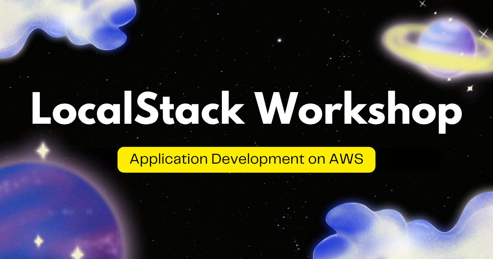

# LocalStack Workshop | Application Development on AWS

## Languages

- English (this page)
- [日本語 — Zenn Book「LocalStack 実践入門 | AWS アプリケーション開発ワークショップ」](https://zenn.dev/kakakakakku/books/aws-application-workshop-using-localstack)

## About

LocalStack is an AWS emulator that runs on your local machine or in CI environments. This workshop is a hands-on introduction to LocalStack. You will experience everything from the basics of LocalStack to AWS application development using LocalStack — running Python code and running unit tests with pytest.

The workshop uses GitHub Codespaces, so there is no need to set up an environment on your laptop — you can try it right away in your browser.

This workshop covers the following AWS services (in no particular order):

- Amazon SQS
- Amazon S3
- AWS CloudFormation
- AWS SAM
- AWS Lambda
- Amazon CloudWatch Logs
- Amazon API Gateway

## Table of Contents

1. [Set Up Your Workshop Environment](docs/01-setup.md)
2. [Try LocalStack](docs/02-hello-localstack.md)
3. [Work with Amazon SQS and Amazon S3 from Python](docs/03-boto3.md)
4. [Automate Deployment with AWS CloudFormation](docs/04-cloudformation.md)
5. [Deploy a Serverless Application with AWS SAM](docs/05-sam.md)
6. [Run Unit Tests with a Disposable LocalStack](docs/06-test.md)
7. [Deploy an API with Amazon API Gateway](docs/07-api.md)

## LocalStack Workshop Series

Check out the other workshops in the series!

|  |  |  |
|:---:|:---:|:---:|
| [Serverless Patterns on AWS](https://github.com/kakakakakku/aws-serverless-pattern-workshop-using-localstack) | [Terraform on AWS](https://github.com/kakakakakku/aws-terraform-workshop-using-localstack) | [Pulumi on AWS](https://github.com/kakakakakku/aws-pulumi-workshop-using-localstack) |

## Sponsors

If you find this workshop useful, consider supporting my work — it keeps the workshops maintained and motivates new ones 😃

- [GitHub Sponsors](https://github.com/sponsors/kakakakakku)
- [Buy Me a Coffee](https://buymeacoffee.com/kakakakakku)
