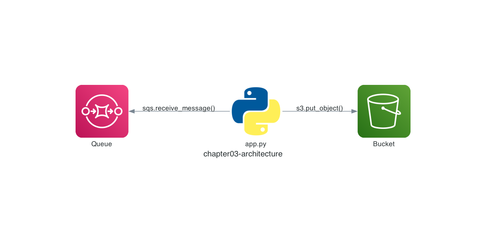

# Chapter 3: Work with Amazon SQS and Amazon S3 from Python

## Architecture

In Chapter 3, let's deploy an Amazon SQS queue and an Amazon S3 bucket to LocalStack and operate them from Python code!

Here is the architecture we are going to build.



## Deploy an Amazon SQS Queue and an Amazon S3 Bucket

First, deploy an Amazon SQS queue and an Amazon S3 bucket with the `awslocal` command.

```sh
$ awslocal sqs create-queue \
    --queue-name chapter03-queue \
    --attributes ReceiveMessageWaitTimeSeconds=20
{
    "QueueUrl": "http://sqs.us-east-1.localhost.localstack.cloud:4566/000000000000/chapter03-queue"
}

$ awslocal s3api create-bucket \
    --bucket chapter03-bucket
{
    "Location": "/chapter03-bucket",
    "BucketArn": "arn:aws:s3:::chapter03-bucket"
}
```

## Send Messages to the Amazon SQS Queue

Next, send two messages to the Amazon SQS queue with the `awslocal` command. The messages are JSON strings: `{ "id": "id0001", "body": "This is message 0001." }` and `{ "id": "id0002", "body": "This is message 0002." }`.

```sh
$ awslocal sqs send-message \
    --queue-url http://sqs.us-east-1.localhost.localstack.cloud:4566/000000000000/chapter03-queue \
    --message-body '{ "id": "id0001", "body": "This is message 0001." }'

$ awslocal sqs send-message \
    --queue-url http://sqs.us-east-1.localhost.localstack.cloud:4566/000000000000/chapter03-queue \
    --message-body '{ "id": "id0002", "body": "This is message 0002." }'
```

## Operate AWS from Python Code

To operate AWS resources from Python code, we use the [AWS SDK for Python (Boto3)](https://aws.amazon.com/sdk-for-python/).

In this chapter, we use Boto3 to receive the messages from the Amazon SQS queue and save each of them as an object in the Amazon S3 bucket, using the message's `id` value as the object key.

Run the following commands. The code is in `chapter03/app.py`.

> [!NOTE]
> If you would like to understand the code before running it, read the "Code Walkthrough" section at the end of this chapter first, then come back here.

`CODESPACE_VSCODE_FOLDER` is the working directory where GitHub Codespaces downloads the repository code.

```sh
$ cd ${CODESPACE_VSCODE_FOLDER}/chapter03
$ pip install -r src/requirements.txt
$ python src/app.py
```

## Verify the Resources

Use the LocalStack AWS CLI to check the chapter03-bucket bucket. If `id0001.json` and `id0002.json` are there, it worked!

```sh
$ awslocal s3 ls chapter03-bucket
2026-07-27 00:00:00         51 id0001.json
2026-07-27 00:00:00         51 id0002.json
```

We just connected Amazon SQS and Amazon S3 with a small piece of Python code 😀

If you download `id0001.json`, you can confirm that the message sent to the Amazon SQS queue was saved correctly.

```sh
$ awslocal s3 cp s3://chapter03-bucket/id0001.json -
{ "id": "id0001", "body": "This is message 0001." }
```

Handy, isn't it?

That's it for Chapter 3! ✋

## Code Walkthrough

Here is a quick walkthrough of the key points in the code. Feel free to skip this section.

### `src/app.py`

First, the code initializes an Amazon SQS client with Boto3. Just like running the `awslocal` command, specifying `endpoint_url` makes it operate LocalStack.

```python
sqs = boto3.client('sqs', endpoint_url='http://localhost:4566')
```

Then it receives messages with the Amazon SQS [`receive_message()`](https://boto3.amazonaws.com/v1/documentation/api/latest/reference/services/sqs/client/receive_message.html) function.

By default, at most one message is received per call. Here we set `MaxNumberOfMessages` so that up to 10 messages can be received at once.

```python
queue_url = 'http://sqs.us-east-1.localhost.localstack.cloud:4566/000000000000/chapter03-queue'

response = sqs.receive_message(
    QueueUrl=queue_url,
    MaxNumberOfMessages=10,
)
```

Next, the code initializes an Amazon S3 client, again specifying `endpoint_url`.

For each message received from the Amazon SQS queue, the code saves an object to the Amazon S3 bucket using the `id` value contained in the message. Objects are saved with the Amazon S3 [`put_object()`](https://boto3.amazonaws.com/v1/documentation/api/latest/reference/services/s3/client/put_object.html) function.

One important detail: receiving a message does not remove it from the Amazon SQS queue. After the visibility timeout (30 seconds by default) elapses, the message automatically returns to the queue. That is why the code explicitly deletes each message with the Amazon SQS [`delete_message()`](https://boto3.amazonaws.com/v1/documentation/api/latest/reference/services/sqs/client/delete_message.html) function.

```python
s3 = boto3.client('s3', endpoint_url='http://localhost:4566')

for message in response.get('Messages', []):
    body = json.loads(message['Body'])
    s3.put_object(
        Bucket='chapter03-bucket',
        Key=body['id'] + '.json',
        Body=message['Body'],
    )
    sqs.delete_message(
        QueueUrl=queue_url,
        ReceiptHandle=message['ReceiptHandle'],
    )
```

That's it for the code walkthrough.

**Next: [Chapter 4: Automate Deployment with AWS CloudFormation](04-cloudformation.md)**
