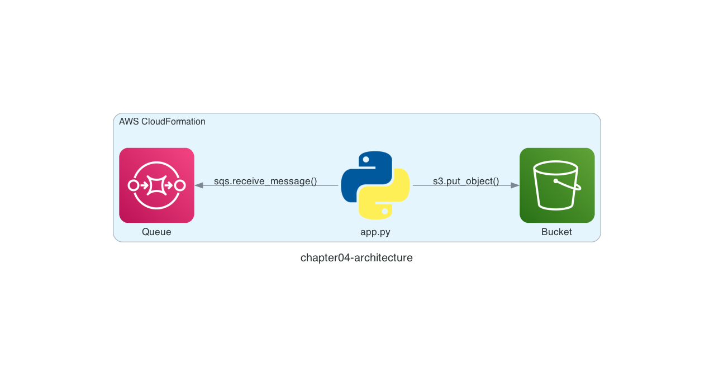

# Chapter 4: Automate Deployment with AWS CloudFormation

## Architecture

In Chapter 3, we deployed the Amazon SQS queue and the Amazon S3 bucket with the `awslocal` command. LocalStack also supports **AWS CloudFormation**. In Chapter 4, let's deploy an Amazon SQS queue and an Amazon S3 bucket to LocalStack with AWS CloudFormation.

Here is the architecture we are going to build.



## Deploy an AWS CloudFormation Stack

First, confirm with the `awslocal` command that no AWS CloudFormation stacks exist yet.

```sh
$ cd ${CODESPACE_VSCODE_FOLDER}/chapter04
$ awslocal cloudformation describe-stacks
{
    "Stacks": []
}
```

Then deploy an AWS CloudFormation stack with the `awslocal` command. The AWS CloudFormation template to deploy is in `chapter04/template.yaml`.

> [!NOTE]
> If you would like to understand the code before running it, read the "Code Walkthrough" section at the end of this chapter first, then come back here.

```sh
$ awslocal cloudformation deploy \
    --stack-name chapter04-stack \
    --template-file template.yaml

Waiting for changeset to be created..
Waiting for stack create/update to complete
Successfully created/updated stack - chapter04-stack
```

If you see `Successfully created/updated stack - chapter04-stack`, it worked!

We deployed an Amazon SQS queue and an Amazon S3 bucket easily with AWS CloudFormation 😀

## Verify the Resources

Let's use the LocalStack AWS CLI to check the deployed resources!

First, the Amazon SQS queues. chapter04-queue has been added.

```sh
$ awslocal sqs list-queues
{
    "QueueUrls": [
        "http://sqs.us-east-1.localhost.localstack.cloud:4566/000000000000/chapter02-queue",
        "http://sqs.us-east-1.localhost.localstack.cloud:4566/000000000000/chapter02-queue-awslocal",
        "http://sqs.us-east-1.localhost.localstack.cloud:4566/000000000000/chapter03-queue",
        "http://sqs.us-east-1.localhost.localstack.cloud:4566/000000000000/chapter04-queue"
    ]
}
```

Next, the Amazon S3 buckets. chapter04-bucket has been added.

```sh
$ awslocal s3 ls
2026-07-27 00:00:00 chapter03-bucket
2026-07-27 00:00:00 chapter04-bucket
```

That's it for Chapter 4! ✋

## Code Walkthrough

### `template.yaml`

With AWS CloudFormation, you declare the expected state of the resources you deploy in an AWS CloudFormation template.

Templates can be written in JSON or YAML. YAML tends to be more compact and supports comments, so we use YAML here.

```yaml
Resources:
  Queue:
    Type: AWS::SQS::Queue
    Properties:
      QueueName: chapter04-queue
      ReceiveMessageWaitTimeSeconds: 20
  Bucket:
    Type: AWS::S3::Bucket
    Properties:
      BucketName: chapter04-bucket
```

The [`AWS::SQS::Queue`](https://docs.aws.amazon.com/AWSCloudFormation/latest/UserGuide/aws-resource-sqs-queue.html) resource deploys the Amazon SQS queue, setting `QueueName` (the queue name) and `ReceiveMessageWaitTimeSeconds` (the receive wait time). The receive wait time is set to **20 seconds** to enable [long polling](https://docs.aws.amazon.com/AWSSimpleQueueService/latest/SQSDeveloperGuide/sqs-short-and-long-polling.html) on the queue.

The [`AWS::S3::Bucket`](https://docs.aws.amazon.com/AWSCloudFormation/latest/UserGuide/aws-resource-s3-bucket.html) resource deploys the Amazon S3 bucket, setting only `BucketName` (the bucket name). There are many other settings, such as `VersioningConfiguration` (versioning) and `LifecycleConfiguration` (lifecycle rules) — check the documentation!

That's it for the code walkthrough.

**Next: [Chapter 5: Deploy a Serverless Application with AWS SAM](05-sam.md)**
