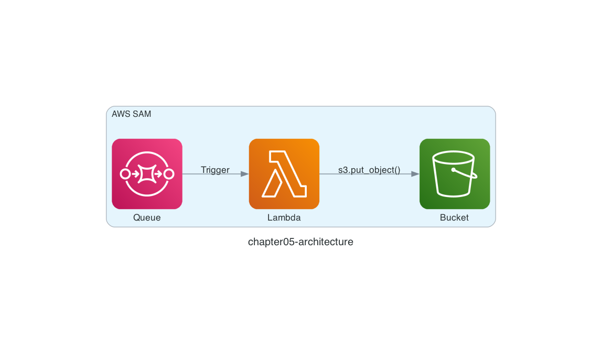

# Chapter 5: Deploy a Serverless Application with AWS SAM

## Architecture

Since LocalStack supports **AWS CloudFormation**, it also works with [**AWS SAM (Serverless Application Model)**](https://aws.amazon.com/serverless/sam/), a framework for building serverless applications. Let's replace the Python code from Chapter 3 with an AWS Lambda function and deploy it to LocalStack as a serverless application!

Here is the architecture we are going to build.

In Chapter 3, the Python code received messages directly from the Amazon SQS queue. AWS Lambda, however, natively supports Amazon SQS events, so the Lambda function no longer needs to fetch messages by itself — the architecture becomes event-driven. Notice that the arrow from the Amazon SQS queue points in the opposite direction now.



## LocalStack AWS SAM CLI

Since Chapter 2, we have been using the LocalStack AWS CLI. The AWS SAM CLI (the `sam` command) also has a LocalStack wrapper: the [LocalStack AWS SAM CLI](https://github.com/localstack/aws-sam-cli-local) (the `samlocal` command).

Set up the LocalStack AWS SAM CLI:

```sh
$ pip install aws-sam-cli-local
```

## Deploy the Serverless Application

Now deploy the serverless application with the `samlocal` command. The AWS SAM template to deploy is in `chapter05/template.yaml`.

> [!NOTE]
> If you would like to understand the code before running it, read the "Code Walkthrough" section at the end of this chapter first, then come back here.

```sh
$ cd ${CODESPACE_VSCODE_FOLDER}/chapter05
$ samlocal build
$ samlocal deploy

Successfully created/updated stack - chapter05-stack in us-east-1
```

If you see `Successfully created/updated stack - chapter05-stack`, it worked!

## Run the Serverless Application

Let's send a message to the Amazon SQS queue with the `awslocal` command. The expectation: sending a message to the queue automatically triggers the AWS Lambda function, which then saves an object to the Amazon S3 bucket. The message is the JSON string `{ "id": "id0003", "body": "This is message 0003." }`.

```sh
$ awslocal sqs send-message \
    --queue-url http://sqs.us-east-1.localhost.localstack.cloud:4566/000000000000/chapter05-queue \
    --message-body '{ "id": "id0003", "body": "This is message 0003." }'
```

## Verify the Resources

Let's use the LocalStack AWS CLI to check the deployed resources!

```sh
$ awslocal s3 ls chapter05-bucket
2026-07-27 00:00:00         49 id0003.json
```

The `id0003.json` object has been saved to the Amazon S3 bucket!

You can also check the logs in the `/aws/lambda/chapter05-function` log group.

```sh
$ awslocal logs tail /aws/lambda/chapter05-function
```

Being able to inspect the AWS Lambda function logs like this is handy, isn't it?

That's it for Chapter 5! ✋

## Code Walkthrough

Here is a quick walkthrough of the key points in the code. Feel free to skip this section.

### `src/app.py`

The code looks similar to Chapter 3, but there are two significant differences.

First, when you configure an Amazon SQS event source mapping for AWS Lambda, event messages arrive in a fixed format. The format is described in the [documentation](https://docs.aws.amazon.com/lambda/latest/dg/with-sqs.html).

Each message is contained under the `Records` key, so the code accesses them via `event['Records']`.

```python
for record in event['Records']:
    print(record)
    body = json.loads(record['body'])
    s3.put_object(
        Bucket='chapter05-bucket',
        Key=f"{body['id']}.json",
        Body=record['body'],
    )
```

Second, while the Chapter 3 code called the Amazon SQS `delete_message()` function explicitly, with an Amazon SQS event source mapping AWS Lambda itself deletes the message once the function finishes successfully.

In other words, with an event source mapping you no longer need to implement `receive_message()` or `delete_message()` — you can focus on processing the messages that arrive.

### `template.yaml`

With AWS SAM, just like AWS CloudFormation, you declare the expected state of your resources in an AWS SAM template.

The `AWS::SQS::Queue` and `AWS::S3::Bucket` resources are the same as in the Chapter 4 AWS CloudFormation template.

```yaml
Function:
  Type: AWS::Serverless::Function
  Properties:
    FunctionName: chapter05-function
    CodeUri: ./src
    Handler: app.lambda_handler
    Runtime: python3.13
    Architectures:
      - x86_64
    Events:
      SqsEvent:
        Type: SQS
        Properties:
          Queue: !GetAtt Queue.Arn
```

What is new is the [`AWS::Serverless::Function`](https://docs.aws.amazon.com/serverless-application-model/latest/developerguide/sam-resource-function.html) resource, which deploys the AWS Lambda function. It sets `FunctionName` (the function name), `Runtime` (the runtime), and so on. Specifying the Amazon SQS queue under `Events` deploys the event source mapping.

That's it for the code walkthrough.

**Next: [Chapter 6: Run Unit Tests with a Disposable LocalStack](06-test.md)**
