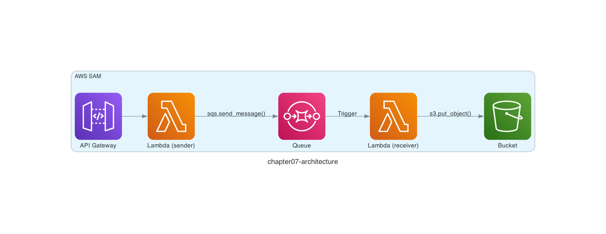

# Chapter 7: Deploy an API with Amazon API Gateway

## Architecture

In Chapter 7, let's extend the architecture we built up through Chapter 6 by integrating **Amazon API Gateway**.

Here is the architecture we are going to build.

When you call Amazon API Gateway — for example, with the `curl` command — the AWS Lambda function (sender) attached to the API runs and sends a message to the Amazon SQS queue. That message then automatically triggers the AWS Lambda function (receiver), which finally saves an object to the Amazon S3 bucket.



## Run the Unit Tests

As a review of Chapter 6, run the following commands to set up the test environment.

```sh
$ cd ${CODESPACE_VSCODE_FOLDER}/chapter07
$ pip install -r src/requirements.txt
$ pip install -r tests/requirements-test.txt
```

Then run the unit tests with the following command. The test code is in `chapter07/tests/test_sender.py` and `chapter07/tests/test_receiver.py`.

> [!NOTE]
> If you would like to understand the code before running it, read the "Code Walkthrough" section at the end of this chapter first, then come back here.

`chapter07/tests/test_sender.py` executes the code that the AWS Lambda function runs and checks that a message is sent to the Amazon SQS queue as expected. `chapter07/tests/test_receiver.py` executes the code that the AWS Lambda function runs and checks that an object is saved to the Amazon S3 bucket as expected.

```sh
$ ENV=test python -m pytest -p no:warnings --verbose

tests/test_receiver.py::test_main PASSED
tests/test_sender.py::test_main PASSED
```

If you see `PASSED`, it worked!

## Deploy the Serverless Application

Deploy the serverless application with the `samlocal` command.

```sh
$ samlocal build
$ samlocal deploy

Successfully created/updated stack - chapter07-stack in us-east-1
```

If you see `Successfully created/updated stack - chapter07-stack`, it worked!

Toward the end of the deploy output, you should find a section like the following. Copy the `ApiId` value (`xxxxxxxxxx` in this example).

```
Key                 ApiId
Description         -
Value               xxxxxxxxxx
```

## Run the Serverless Application

Replace `xxxxxxxxxx` in the URL below with your `ApiId` value and call Amazon API Gateway.

A randomly numbered `id` comes back. We just called Amazon API Gateway 😀

```sh
$ curl -s -X POST http://xxxxxxxxxx.execute-api.localhost.localstack.cloud:4566/Prod/ | jq  .
{
  "id": "id2140"
}
```

## Verify the Resources

Let's use the LocalStack AWS CLI to check the deployed resources!

> [!NOTE]
> The file name is randomly numbered, so yours may differ.

```sh
$ awslocal s3 ls s3://chapter07-bucket --recursive
2026-07-27 00:00:00         50 chapter07/id2140.json
```

The `chapter07/id2140.json` object has been saved to the Amazon S3 bucket!

## Summary

Using LocalStack, we ran a serverless application that connects Amazon API Gateway, AWS Lambda, Amazon SQS, and Amazon S3.

That's it for Chapter 7! ✋

Congratulations on completing the workshop! 🎉

## Code Walkthrough

Here is a quick walkthrough of the key points in the code. Feel free to skip this section.

### `src/sender.py`

This AWS Lambda function is triggered by calls to Amazon API Gateway.

In Chapter 6 and earlier, we used the `awslocal` command to send JSON strings such as `{ "id": "id0004", "body": "This is message 0004." }` to the Amazon SQS queue. This function does the same thing in code, with a randomly generated `id` number.

```python
def main(event):
    number = random.randint(0, 9999)
    sqs.send_message(
        QueueUrl='http://sqs.us-east-1.localhost.localstack.cloud:4566/000000000000/chapter07-queue',
        MessageBody=json.dumps(
            {
                'id': f'id{number:04}',
                'body': f'This is message {number:04}.',
            }
        ),
    )

    return {
        'statusCode': 200,
        'body': json.dumps(
            {'id': f'id{number:04}'},
        ),
    }
```

### `tests/test_sender.py`

The test code starts a disposable LocalStack, just like in Chapter 6, and deploys an Amazon SQS queue.

```python
@pytest.fixture(scope='module', autouse=True)
def _setup():
    startup_localstack(
        image_name='localstack/localstack:4.14.0',
        gateway_listen='0.0.0.0:14566',
    )

    sqs.create_queue(
        QueueName='chapter07-queue',
        Attributes={
            'ReceiveMessageWaitTimeSeconds': '20',
        },
    )

    yield

    stop_localstack()
```

It then builds an event object in the same format that Amazon API Gateway uses when invoking an AWS Lambda function, and calls the `main()` function. Finally, it asserts on the content of the message delivered to the Amazon SQS queue.

```python
def test_main():
    event = {
        'resource': '/',
        'path': '/',
        'httpMethod': 'POST',
    }

    main(event)

    response = sqs.receive_message(
        QueueUrl='http://sqs.us-east-1.localhost.localstack.cloud:14566/000000000000/chapter07-queue',
        MaxNumberOfMessages=10,
    )

    assert 1 == len(response['Messages'])
    body = json.loads(response['Messages'][0]['Body'])
    assert 'id' in body
    assert re.match(r'id\d{4}', body['id'])
```

### `src/receiver.py`

This AWS Lambda function is triggered when a message is sent to the Amazon SQS queue, and saves an object to the Amazon S3 bucket. It is almost identical to Chapter 6.

```python
def main(event):
    for record in event['Records']:
        print(record)
        body = json.loads(record['body'])
        s3.put_object(
            Bucket='chapter07-bucket',
            Key=f"chapter07/{body['id']}.json",
            Body=record['body'],
        )
```

### `template.yaml`

In Chapters 5 and 6, we deployed event source mappings by listing the Amazon SQS queue under `Events` in the [`AWS::Serverless::Function`](https://docs.aws.amazon.com/serverless-application-model/latest/developerguide/sam-property-function-eventsource.html) resource. In Chapter 7, the AWS Lambda function (sender) is invoked by Amazon API Gateway instead, so `Events` specifies Amazon API Gateway with an API resource definition. Here we bind a `POST` request on the `/` API endpoint. Everything else is mostly the same.

```yaml
SenderFunction:
  Type: AWS::Serverless::Function
  Properties:
    FunctionName: chapter07-sender-function
    CodeUri: ./src
    Handler: sender.lambda_handler
    Runtime: python3.13
    Architectures:
      - x86_64
    Environment:
      Variables:
        ENV: local
    Events:
      Api:
        Type: Api
        Properties:
          Method: POST
          Path: /
```

There are other event source types you can specify under `Events` — see the [documentation](https://docs.aws.amazon.com/serverless-application-model/latest/developerguide/sam-property-function-eventsource.html) for details.

That's it for the code walkthrough.

**Back to the [Table of Contents](../README.md)**
